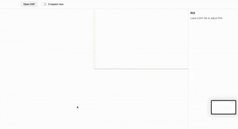

# Three.js DXF Cropping App

A lightweight DXF viewer and cropping tool built with TypeScript, Three.js, and Vite.
It lets users import DXF drawings, visualize them in 3D, define a region of interest (ROI), toggle between cropped and uncropped views, and (optionally) export cropped geometry.

<p align="center">
  
</p>

## 🚀 Getting Started

Requirements
`Node.js ≥ 18`
`npm ≥ 9`
Installation

```bash
npm install
```

Run in Development

```bash
npm run dev
```

Starts the app in development mode with hot reload (Vite).

Build for Production

```bash
npm run build
```

Outputs optimized static files under /dist.

Preview Production Build

```bash
npm run preview
```

Runs a local server to preview the built app.

## 🏗️ Architecture Overview

Layer Responsibility:

- DXF I/O Uses dxf-parser
  for reading geometry. (Future: dxf-writer for export.)
- Model Translates parsed DXF entities into Three.js objects — currently supports POLYLINE (Polyface) entities.
- View (Three.js) Renders entities in a WebGL scene using @react-three/fiber and OrbitControls.
- UI (React) React + Zustand store for global state (DXF data, ROI bounds, view mode). Side panel for ROI numeric fields, top bar for actions.
- Crop System Two layers: rendering-level clip (for view toggle) and data-level crop (for export). Currently, only render-level clipping is implemented.

## ⚙️ Key Trade-offs

##### Async parsing is skipped for simplicity,

but large files may need chunked parsing for performance. The app currently uses the synchronous `parseSync()` method from dxf-parser for simplicity and predictable control flow.

The library also exposes an asynchronous variant:

```typescript
parseStream(stream: Readable): Promise<IDxf>;
```

This could be integrated to support large DXF files without blocking the main thread.
However, doing so would require handling async parsing states, progress feedback, and error handling during stream consumption — which were intentionally left out to keep the app minimal and focused for this take-home.

##### Single Group Render Model:

All entities merged into a THREE.Group (meshGroup) for simplicity.
Ideal for small to medium drawings, though per-layer grouping could improve visibility control.

## 📐 Entity Support

Entity Status Notes

- POLYLINE (Polyface) ✅ Supported Rendered as mesh via buildMeshFromPolyface.
- LWPOLYLINE 🚧 Planned Will be handled by a lightweight Polyline → geometry builder.
- 3DFACE 🚧 Planned Straightforward to support via simple THREE.BufferGeometry faces.

## 🧠 Code Notes

Entity Conversion

Currently:

```javascript
for (const entity of dxf.entities) {
  if (entity.type === "POLYLINE") {
    const mesh = buildMeshFromPolyface(entity as IPolylineEntity);
    if (mesh) {
      meshes.push(mesh);
      meshGroup.add(mesh);
    }
  }
}
```

🔧 Planned improvement:
Create a polymorphic factory:

```javascript
const mesh = buildEntityMesh(entity);
```

…where buildEntityMesh internally checks entity.type and constructs the proper geometry class without type assertions.

## ⚠️ Limitations

- Only supports POLYLINE (Polyface) entities at the moment.
- No DXF export yet — only visual cropping.
- No layer visibility toggling yet.
- No async parsing → large DXFs might cause frame hiccups.

🧪 Testing Checklist

✅ Import DXF and see geometry rendered.
✅ ROI can be resized and moved both visually and numerically.
✅ Toggle between Cropped / Uncropped view keeps ROI state.
⏳ Export not yet functional (planned extension).
